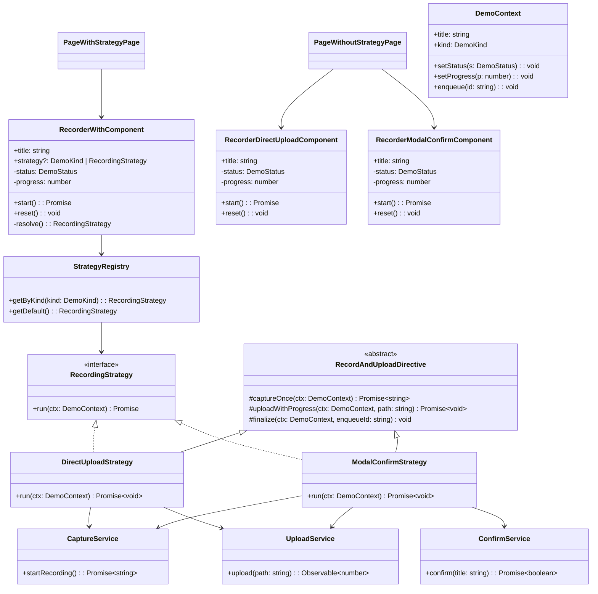

# Strategy Pattern Demo (Pure Angular)

The **Strategy Pattern** lets us encapsulate alternative *flows* behind a common interface. Instead of scattering `if/else` logic through components, each algorithm lives in its own class, and the component delegates to the selected strategy at runtime. This keeps UI code clean, makes the system extensible, and lets us vary behavior via DI configuration.

## Overview

Two screens to compare approaches:

- **Without Strategy** (default route): a component branches on an input `kind` and mixes orchestration with UI state.
- **With Strategy** : the same UI delegates all orchestration to pluggable strategies resolved via a registry and DI. The component can still accept a `kind` string, or a **concrete strategy instance** (great for unit tests).

## Run

```bash
npm install
npm start
```

Then open http://localhost:4200

## Add a new flow (Strategy version)

1. Create `new-flow.strategy.ts` implementing `RecordingStrategy`.
2. Bind it in `app.config.ts`:

```ts
provideRecordingStrategyBindings([
  // ...
  { kind: DemoKind.YourNewKind, strategy: YourNewStrategy }
]);
```

3. Use it in the page:

```html
<app-recorder-with title="Your New Flow" [strategy]="DemoKind.YourNewKind"></app-recorder-with>
```

No component churn required.

---

## Recording Strategies Architecture — How to Read the Diagram

This diagram maps the **roles and relationships** in our demo app—what talks to what, and why. It’s not step‑by‑step code; it’s the architecture at a glance.

- **Boxes** are the key building blocks:
  - *Components* (UI parts you see on screen).
  - *Strategies* (pluggable orchestration for recordings).
  - *Helpers/services* (shared utilities and base classes).

- **Lines** show relationships:
  - A plain arrow means “**uses**” (depends on).
  - A triangle arrow means “**is a kind of**” (inheritance/implementation).

---

## Without Strategy (feature: `page-without-strategy/`)

Two separate components — `RecorderDirectUploadComponent` and `RecorderModalConfirmComponent` — each own their orchestration (capture → maybe confirm → upload). Logic is duplicated; adding flows multiplies components and tests.

- **Pros:** simple to start.
- **Cons:** duplication, test drift, harder refactors, component churn for every new flow.

## With Strategy (feature: `page-with-strategy/`)

The UI component `RecorderWithComponent` delegates to a **strategy** chosen via DI (`StrategyRegistry`). Strategies (`DirectUploadStrategy`, `ModalConfirmStrategy`) inherit shared logic from the abstract `RecordAndUploadDirective`, keeping components lean and testable.

- **Pros:** pluggable flows, thin UI, fast tests, add flows via a class + binding.
- **Trade‑offs:** a tiny bit of upfront structure (interfaces + DI registry).

---

## The Context

`DemoContext` (`src/app/shared/models.ts`) is the data + callbacks a strategy needs:
- `title`, `kind`
- `setStatus`, `setProgress`
- `enqueue(id)` — remains the last event (so tests can assert end‑of‑flow)

## Shared Helpers

Strategies compose simple services:
- `CaptureService` – simulates capture timing
- `UploadService` – emits 0→1 progress
- `ConfirmService` – yes/no confirmation

## Registry

`StrategyRegistry` maps a “kind” to its strategy via DI bindings (see `app.config.ts`). Add a new flow by binding a new strategy class; no UI churn.

---



---

## Where Things Live (matching this repo)

```
src/app/components/
  recorder-direct-upload/…         # without-strategy UI: direct upload
  recorder-modal-confirm/…         # without-strategy UI: modal confirm
  recorder-with/…                  # with-strategy UI (delegates to DI)

src/app/core/recording/
  strategies/
    direct-upload.strategy.ts       # concrete strategy
    modal-confirm.strategy.ts       # concrete strategy
  record-and-upload.directive.ts    # abstract base with shared steps
  recording-strategy.registry.ts    # DI registry & bindings
  recording-strategy.types.ts       # interface contracts

src/app/core/services/
  capture/capture.service.ts        # fake capture
  upload/upload.service.ts          # progress stream
  confirm/confirm.service.ts        # confirm dialog

src/app/features/
  page-without-strategy/…           # demo page: without strategy
  page-with-strategy/…              # demo page: with strategy
```

---

## TL;DR (for the slide)

- **Problem:** duplicated orchestration across components; branching by “kind”; test drift.  
- **Solution:** Strategy pattern + DI registry + shared base directive → pluggable flows, thin components.  
- **Outcome:** add a new flow by adding a class and a binding—no UI churn, simpler testing.

## Read More

- [Strategy Pattern (Wikipedia)](https://en.wikipedia.org/wiki/Strategy_pattern)
- [SourceMaking - Strategy Pattern](https://sourcemaking.com/design_patterns/strategy)
- [Refactoring Guru - Strategy Pattern](https://refactoring.guru/design-patterns/strategy)
- [Refactoring Guru - Strategy Pattern (TypeScript)](https://refactoring.guru/design-patterns/strategy/typescript/example)
- [Angular - Dependency Injection Providers](https://angular.dev/guide/di/dependency-injection-providers#using-an-injectiontoken-object)
- [Angular - Dependency Injection](https://angular.dev/guide/di/dependency-injection)
- [Medium - Strategy Design Pattern in TypeScript](https://medium.com/@robinviktorsson/a-guide-to-the-strategy-design-pattern-in-typescript-and-node-js-with-practical-examples-c3d6984a2050)
- [Medium - Implementing Strategy Pattern in TypeScript](https://medium.com/@hmaccelerate/implementing-strategy-pattern-in-typescript-using-functional-programming-0a5881e4ffc3)